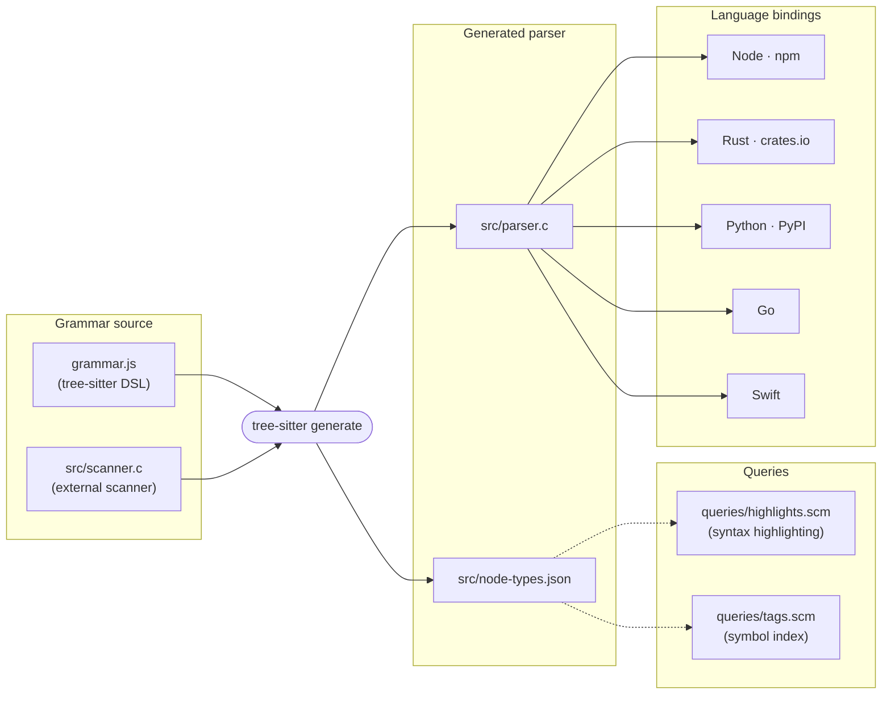

# tree-sitter-sas

A [tree-sitter](https://github.com/tree-sitter/tree-sitter) grammar for the [SAS programming language](https://www.sas.com/).

[](https://www.npmjs.com/package/tree-sitter-sas)
[](https://github.com/ix-infrastructure/tree-sitter-sas/actions/workflows/ci.yml)
[](LICENSE)

## Node bindings

Available on npm as [`tree-sitter-sas`](https://www.npmjs.com/package/tree-sitter-sas).

```bash
npm install tree-sitter-sas
```

Prebuilt native binaries ship for `linux-x64`, `darwin-x64`, and `darwin-arm64` — no compile step required.

## Rust bindings

> **Coming soon** — a crates.io release is planned. In the meantime, use the GitHub source directly:
>
> ```toml
> [dependencies]
> tree-sitter-sas = { git = "https://github.com/ix-infrastructure/tree-sitter-sas" }
> ```

## Python bindings

> **Coming soon** — a PyPI release is planned. In the meantime, build from source:
>
> ```bash
> pip install git+https://github.com/ix-infrastructure/tree-sitter-sas
> ```

## Go bindings

```go
import "github.com/ix-infrastructure/tree-sitter-sas/bindings/go"
```

## Swift bindings

Add to `Package.swift`:

```swift
.package(url: "https://github.com/ix-infrastructure/tree-sitter-sas", from: "0.3.1")
```

## Architecture



`grammar.js` defines the language using the tree-sitter DSL. `src/scanner.c` is an external lexer that
disambiguates `%`-prefixed macro keywords (`%let`, `%macro`, `%mend`, `%include`) from user-defined macro
calls — it emits a keyword token only when the keyword is **not** immediately followed by an identifier
character, so `%letput` and `%macroFoo` correctly fall through to `macro_call_statement` instead.
Running `tree-sitter generate` produces the LR parser (`src/parser.c`) and the node type schema
(`src/node-types.json`).

## Language coverage

| Construct | Node type |
|---|---|
| `DATA` step | `data_step` |
| `PROC` step | `proc_step` |
| `%MACRO` / `%MEND` definition | `macro_definition` |
| `%name(args)` call statement | `macro_call_statement` |
| `%name(args)` inline call | `macro_call` |
| `%LET var = value` | `macro_variable_assignment` |
| `&var`, `&&var`, `&var.` references | `macro_variable_ref` |
| `%INCLUDE 'path'` | `include_statement` |
| `LIBNAME libref ...` | `libname_statement` |
| `OPTIONS ...` | `options_statement` |
| `/* ... */` block comments | `block_comment` |
| `* ... ;` line comments | `line_comment` |
| `%* ... ;` macro comments | `percent_comment` |
| Everything else | `generic_statement` (flat fallback) |

Statements not matched by a specific rule are absorbed by `generic_statement`, which preserves the source
text without losing parse continuity. The tree is always complete — unknown or proc-specific syntax never
breaks the parse.

## Known deviations

### `generic_statement` as a catch-all

SAS has hundreds of proc-specific statements (`MODEL`, `CLASS`, `OUTPUT` inside `PROC REG`, etc.) that
would require individual rules to represent structurally. This grammar uses `generic_statement` as a flat
fallback for any semicolon-terminated statement not matched by a more specific rule. The tradeoff: internal
proc statement structure is not captured in the tree, but the tree is always well-formed and the
surrounding program structure is always intact.

### Macro keyword disambiguation via external scanner

`%KEYWORD` tokens share a prefix with user-defined macro calls. The external scanner in `src/scanner.c`
resolves the ambiguity: it emits a structured keyword token only when the keyword is **not** immediately
followed by `[A-Za-z0-9_]`. This means `%letput` is a macro call, not a `%let` statement — matching
SAS's own behavior.

### Bare `%` in non-macro contexts

A literal `%` can appear in non-macro positions (e.g. `width=20%` in ODS style attributes). The external
scanner emits a `_bare_pct` token for these cases, which is absorbed into `generic_statement` content
without triggering a macro parse path.

## References

- [SAS Macro Language Reference](https://documentation.sas.com/doc/en/mcrolref/9.4/titlepage.htm)
- [SAS Language Reference: Concepts](https://documentation.sas.com/doc/en/lrcon/9.4/titlepage.htm)
- [tree-sitter documentation](https://tree-sitter.github.io/tree-sitter/)
